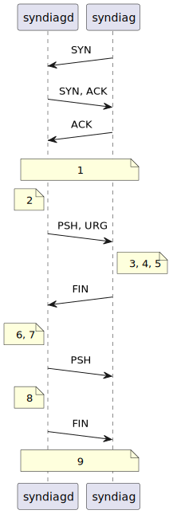
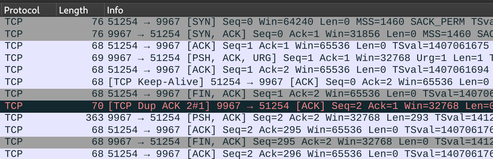
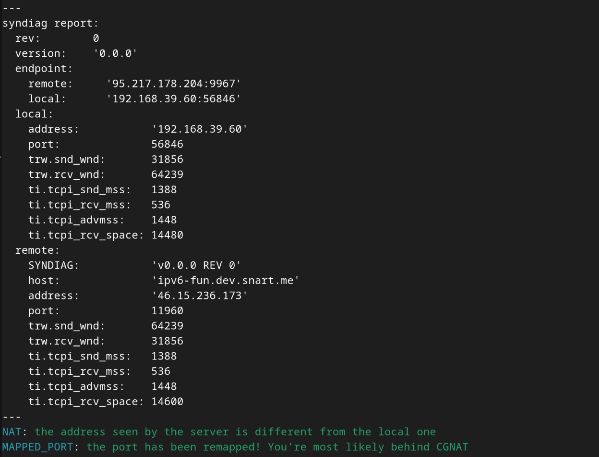
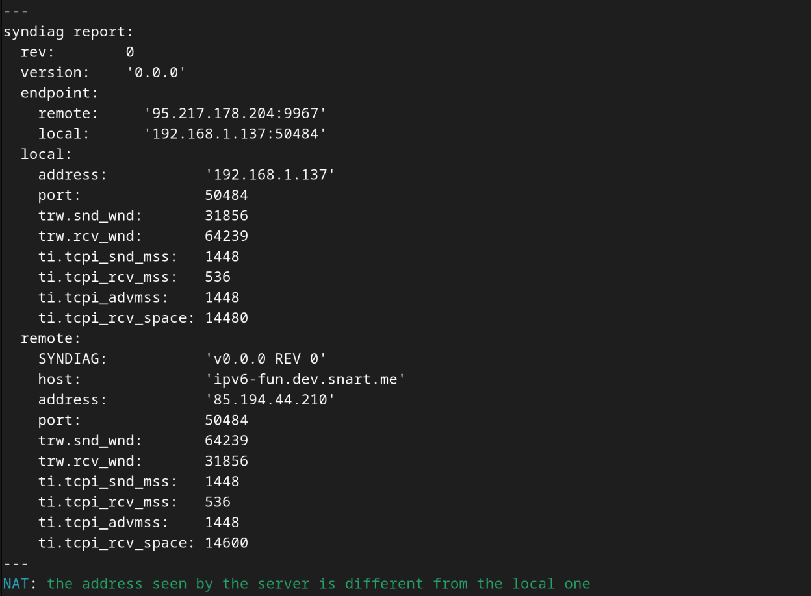
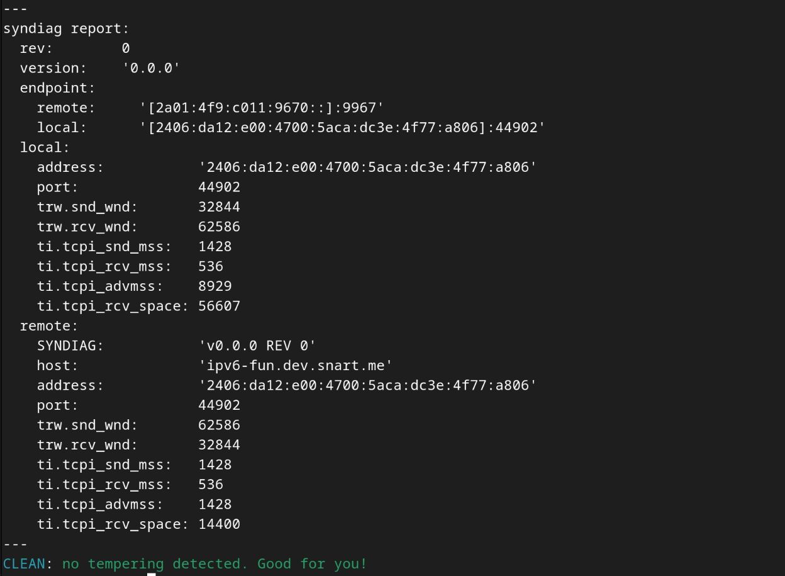
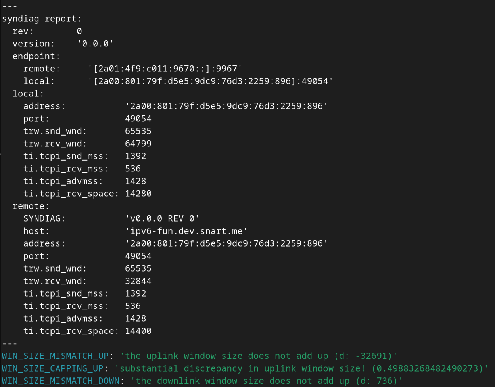
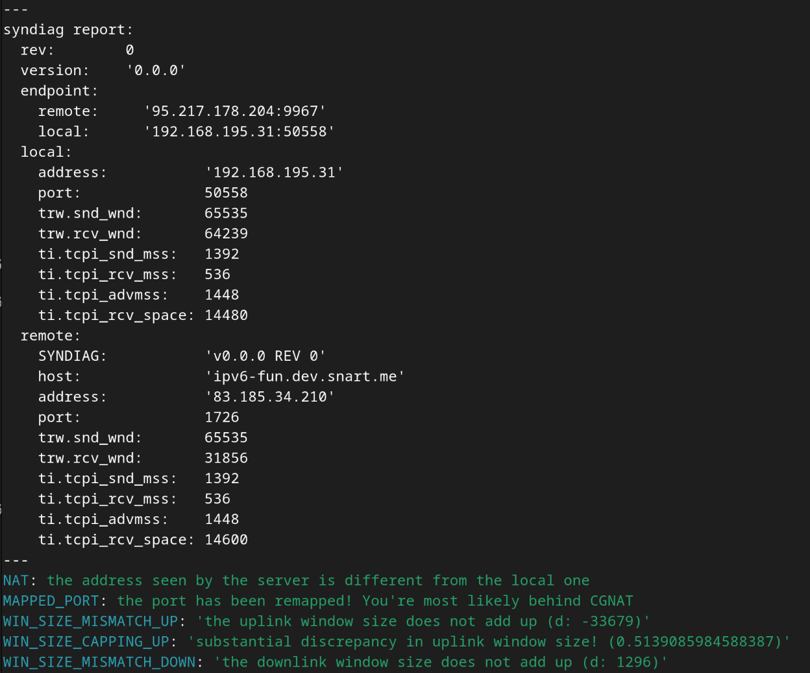

# Syndiag: the TCP SYN diagnostics tools
Syndiag is a set of tools to detect tempering of TCP packets by the middleboxes
in the network. The special TCP socket options in Linux are used to access the
state values of the connection.

Copyright (c) 2024 David Timber &lt;dxdt@dev.snart.me&gt;

The tool consists of three programs:

- **syndiagd**
- **syndiag**
- **read-syndiag**

**syndiagd** is the server that is run on a "clean" network where no middle
boxes between the premise and the internet manipulate any packet. **syndiag** is
the client program that is run on the network to test. **read-syndiag** is a
Python script that reads the output of syndiag, interprets and explains it for
the human user to understand. **syndiag-run** is a convenience script that can
be used to run syndiag and read-syndiag at the same time. The port **9967/TCP**
has been chosen as a standard port for the tool.

```sh
syndiag-run -4 syndiag.dev.si-magic.com
syndiag-run -6 syndiag.dev.si-magic.com
```

Run `syndiag-run -h` for usage.

## Background
[doc/background.md](doc/background.md)

## Glossary and RFCs
TODO table

- Window scaling
- Uplink window size
- Downlink window size
- CGNAT
- Full-cone NAT
- Symmetric NAT
- NAT
- NAT64
- NAT66

## Mechanism



1. connection established
2. the server sends the OOB data in the hopes that the new window size is pushed
   to the client as well
3. the OOB data is received by the client node, (hopefully)along with updated
   window size
4. the client reads and saves the state values using `TCP_REPAIR_WINDOW`
5. the client signals the server by sending FIN
6. the server reads its `TCP_REPAIR_WINDOW`
7. the server sends the data with other extra data collected in pseudo YAML
8. the server sends FIN
9. connection closed

## Installation
TODO

## Server Settings
### Recommended server types
1. One w/ default window params
1. One w/ no window scaling
1. One w/ massive receive window size

## Understanding Syndiag-run Output
Syndiag's main purpose is to detect window size tempering. It also reports some
other information about the network. For full NAT condition check, refer to
STUN(RFC 5389).

### CLEAN
Condition:

- No other condition is true

The test ran successfully and no packet manipulation was detected. This is the
ideal.

### INVALID
Condition: any of `NO_LOCAL_TRW`, `NO_REMOTE_TRW`<!--, NO_LOCAL_WIN_SCALING,
NO_REMOTE_WIN_SCALING--> is set.

The test is invalid because some information was not available to get a
conclusive test result.

### WIN_SIZE_MISMATCH_UP, WIN_SIZE_MISMATCH_DOWN
Significance: **HIGH**

Condition: the window size received by the client is not equal to the value sent
by the server, or vice versa

The middlebox may have changed the uplink or downlink window size. This may be a
result of aggressive TCP acceleration such as ACK spoofing. If this is the case,
it's possible that PMTUD won't work. See [doc/background.md](doc/background.md).

### WIN_SIZE_CAPPING_UP, WIN_SIZE_CAPPING_DOWN
Significance: **HIGH**

Condition: the difference between the window size received by the client and the
one sent by the server, or vice versa, is more than 10%

The middlebox definitely capped the uplink or downlink window size to do
aggressive TCP acceleration such as ACK spoofing. See
[doc/background.md](doc/background.md).

### NAT
Significance: LOW

Condition: the client uses IPv4 to connect to the server AND the server sees the
client's IPv4 address, but it's not the source address the client used to make
the connection

You're behind NAT. NAT for IPv4 connectivity is common and okay as long as it's
[full-cone
NAT](https://en.wikipedia.org/wiki/Network_address_translation#Methods_of_translation).

### NAT66
Significance: **HIGH**

Condition: the client uses IPv6 to connect to the server AND The server sees the
client's IPv6 address, but it's not the source address the client used to make
the connection

Your IPv6 connectivity is through NAT. NAT64 is STUPID for end nodes and should
only be used in special cases. The possible scenarios are:

1. The cloud service provider only offers IPv6 using ULA (Azure)
1. The limitation of the underlying infrastructure such as load balancers and
   internet gateways (GCP)
1. The virtualization technology does not support full-blown IPv6
1. Poorly designed CPE
1. Braindead ISP
1. [It was your
   intention](https://blog.apnic.net/2018/02/02/nat66-good-bad-ugly/) (please
   reconsider)

### IPV_TRANS
Significance: **MEDIUM**

Condition: the connection the server accepted is IPv4, but the client used IPv6
to make the connection, or vice versa

This is a serious problem if both server and client are dual-stacked but the
middlebox is doing NAT translation anyways. In other cases, if either of the
parties lack either of the stacks, it's not necessarily a problem.

### MAPPED_PORT
Significance: **HIGH**

Condition: the remote port of the connection accepted by the server is not the
one the client used for local port

The client is most likely behind symmetric NAT. This makes P2P connection
impossible. This is typical for CGNAT like cellular data network. This is a
serious problem if the network tested is IPv6.

### NO_LOCAL_TRW
The client was unable to read `TCP_REPAIR_WINDOW` most likely due to permission
issues. Syndiag needs `cap_net_admin` capability or be run as root to read the
data. Refer to the error message produced and [Installation](#installation).

### NO_REMOTE_TRW
The server was unable to read `TCP_REPAIR_WINDOW` most likely due to permission
issues. Syndiagd needs `cap_net_admin` capability or be run as root to read the
data. Contact the sysadmin for support. If you're the sysadmin, refer to the
error message produced and [Installation](#installation).

<!--
### NO_LOCAL_WIN_SCALING
### NO_REMOTE_WIN_SCALING
Significance: LOW

Condition: the window size values received by the server/client stayed below
65535

The server/client decided not to ramp up the window size over 65535, possible
with TCP scaling. Some WAN optimizers can get away with it if larger window
values are not tested.

TODO: as the application has no control over the kernel's algo, this attribute
begs more thinking as to how it should be implemented
-->

## Notes
### API used
TODO: packet field and related APIs

### When TCP Scaling is OFF
TODO

### Downlink window size check not performed
TODO

### When the server ramps up downlink window size

## Gallery






## See Also
- http://web.archive.org/web/20240512232328/https://frehberg.com/wp-content/uploads/2019/09/TCP-Out-Of-Band.pdf
- http://web.archive.org/web/20240527034749/https://www.excentis.com/blog/tcp-half-close-a-cool-feature-that-is-now-broken/
