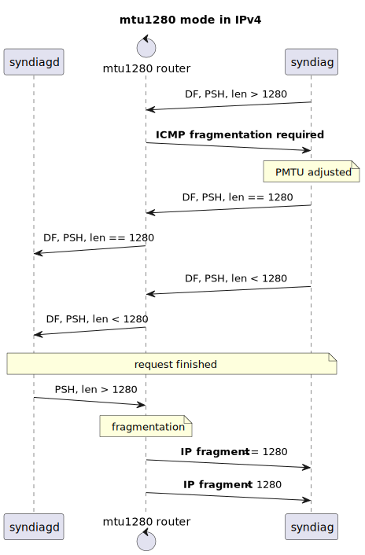
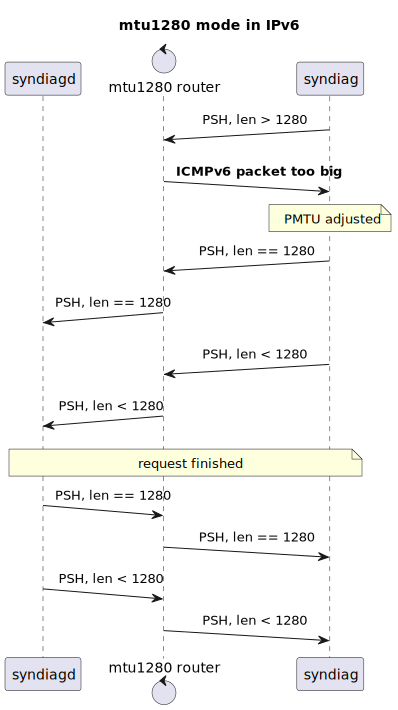

# Syndiag: the TCP SYN diagnostics tools
Syndiag is a set of tools to detect tempering of TCP packets by the middleboxes
in the network. The special TCP socket options in Linux are used to access the
state values of the connection.

Copyright (c) 2024 David Timber &lt;dxdt@dev.snart.me&gt;

With Syndiag, the following characteristics of the network can be tested.

- Whether **NAT**, **NAT64** or **NAT66** is being done
- Whether **PMTUD** is possible on IPv4 and IPv6 network
- Whether fragmented IPv4 packets are allowed over the network
- Whether TCP window is being manipulated (TCP acceleration)

The tool consists of three programs:

- **syndiagd**
- **syndiag**
- **read-syndiag**

**syndiagd** is the server that is run on a "clean" network where no middleboxes
between the premise and the internet. **syndiag** is the client program that is
run on the network to test. **read-syndiag** is a Python script that reads the
output of syndiag, interprets and explains it for the human user to understand.
**syndiag-run** is a convenience script that can be used to run syndiag and
read-syndiag at the same time. The port **9967/TCP** has been chosen as a
standard port for the tool.

```sh
syndiag-run -4 syndiag.dev.si-magic.com
syndiag-run -6 syndiag.dev.si-magic.com
```

Run `syndiag-run -h` for usage.

## Background
- [doc/background.md](doc/background.md)
<!-- - [doc/results.md](doc/results.md) -->

## Glossary and RFCs
TODO table

- Window scaling
- Uplink window size
- Downlink window size
- CGNAT
- Full-cone NAT
- Symmetric NAT
- NAT
- NAT64
- NAT66

## Sequence


1. connection established
2. the server sends the OOB data in the hopes that the new window size is pushed
   to the client as well
3. the OOB data is received by the client node, (hopefully)along with updated
   window size
4. the client reads and saves the state values using `TCP_REPAIR_WINDOW`
5. the client signals the server by sending FIN
6. the server reads its `TCP_REPAIR_WINDOW`
7. the server sends the data with other extra data collected in pseudo YAML
8. the server sends FIN
9. connection closed

## MTU 1280 Mode
Similar to [test-ipv6.com](https://test-ipv6.com/), Syndiag offers the optional
feature of the PMTUD test. As a native program with access to privileged API,
Syndiag also offers the special PMTUD test for IPv4 networks. The difference
from the traditional command line tool `tracepath` is that rather than
discovering PMTU by sending probe packets to the destination, syndiag discovers
the PMTU for the legitimate TCP connection.

To run Syndiag in mtu 1280 mode, use `-T` option. Syndiagd on the server also
has to be run with `-T` option and set up so that it runs behind the mtu 1280
path router. Upon client's request, Syndiagd runs in mtu 1280 mode for that
particular session and zero pads the response data. The users can identify such
servers with "mtu1280" mapping in the response data.

A successful run will result in syndiag successfully printing the report
returning 0. The run will fail with "No data available"(`ENODATA`) if the PMTUD
was not possible.

### MTU 1280 Mode in IPv4


The PMTU on IPv4 networks involves the DF flag and the ICMP fragmentation
required message. To test both, the client sends 1241 zeros, which end up in a
packet larger than 1280 octets. Since the DF flag is set in the packet, the
simulated mtu 1280 path router returns the packet in a fragmented required ICMP
message. The client host then caches and adjusts the PMTU to the server and
carries out TCP retransmission. The server responds with the data padded to 1241
octets. This results in a packet larger than 1281 octets which the router will
fragment into packets smaller than 1280 octets.

Two things are tested:

1. "Fragmentation required" ICMP messages are allowed
1. Fragmented IPv4 packets are allowed

all of which are required for PMTUD in IPv4.

### MTU 1280 Mode in IPv6


This is the traditional IPv6 PMTUD. All it requires is that ICMPv6 is allowed.

## Installation
- Required packages to build the project: `cmake gcc`
- Optional packages
  - `libcap` to use syndiag without root

glibc and musl are supported. Syndiag and syndiagd requires `cap_net_admin` cap
for `TCP_REPAIR_WINDOW`. For convenience, setcap is done on syndiag after
installation.

```sh
git clone https://github.com/si-magic/syndiag
cd syndiag
cmake -B build
cd build
make
sudo make install
```

## Server Settings
The `syndiagd.service` systemd unit is provided. For extra options, place an
environment file at `/etc/syndiag/syndiagd.conf`.

```ini
SYNDIAGD_OPTS_EXTRA="-T -C 'https://your-website.com/syndiag/'"
```

Use [drop-in
units](https://www.freedesktop.org/software/systemd/man/latest/systemd.unit.html#Description)
to override settings such as ` NetworkNamespacePath=`, `After=` and
`Requisite=` to incorporate mtu1280d-netns.

### MTU 1280
There are many ways to achieve simulated mtu 1280 path. One feasible and easy
way is to use the Linux network namespace. See the [netns mtu1280d
implementation](https://github.com/si-magic/mtu1280d/tree/master/netns) for
more.

### Recommended server types for window tempering detection
Since it's difficult to guess the characteristics of proprietary TCP optimizers,
it could be a good idea to set up servers with different TCP window parameters.
To run different set ups in the same host, multiple instances of syndiagd can be
run in different network namespaces. Here are some other recommended server set
ups.

#### No window scaling
`net.ipv4.tcp_window_scaling = 0`

To see if the accelerator tries to boost the connection by bumping up the window
size. The give away will be the server getting the uplink window more than
65535, which is not possible without window scaling.

#### Very small receive window size (< 65535)
Same as [#No window scaling](#no_window_scaling).

#### Massive receive window size (> 1048576)
To see if the accelerator caps the uplink window to shape bandwidth and reduce
memory footprint.

## Understanding Syndiag-run Output
Syndiag's main purpose is to detect window size tempering. It also reports some
other information about the network. For full NAT condition check, refer to
STUN(RFC 5389).

### CLEAN
Condition:

- No other condition is true

The test ran successfully and no packet manipulation was detected. This is the
ideal.

### INVALID
Condition: any of `NO_LOCAL_TRW`, `NO_REMOTE_TRW`<!--, NO_LOCAL_WIN_SCALING,
NO_REMOTE_WIN_SCALING--> is set.

The test is invalid because some information was not available to get a
conclusive test result.

### WIN_SIZE_MISMATCH_UP, WIN_SIZE_MISMATCH_DOWN
Significance: **HIGH**

Condition: the window size received by the client is not equal to the value sent
by the server, or vice versa

The middlebox may have changed the uplink or downlink window size. This may be a
result of aggressive TCP acceleration such as ACK spoofing. If this is the case,
it's possible that PMTUD won't work. See [doc/background.md](doc/background.md).

### WIN_SIZE_CAPPING_UP, WIN_SIZE_CAPPING_DOWN
Significance: **HIGH**

Condition: the difference between the window size received by the client and the
one sent by the server, or vice versa, is more than 10%

The middlebox definitely capped the uplink or downlink window size to do
aggressive TCP acceleration such as ACK spoofing. See
[doc/background.md](doc/background.md).

### NAT
Significance: LOW

Condition: the client uses IPv4 to connect to the server AND the server sees the
client's IPv4 address, but it's not the source address the client used to make
the connection

You're behind NAT. NAT for IPv4 connectivity is common and okay as long as it's
[full-cone
NAT](https://en.wikipedia.org/wiki/Network_address_translation#Methods_of_translation).

### NAT66
Significance: **HIGH**

Condition: the client uses IPv6 to connect to the server AND The server sees the
client's IPv6 address, but it's not the source address the client used to make
the connection

Your IPv6 connectivity is through NAT. NAT64 is STUPID for end nodes and should
only be used in special cases. The possible scenarios are:

1. The cloud service provider only offers IPv6 using ULA (Azure)
1. The limitation of the underlying infrastructure such as load balancers and
   internet gateways (GCP)
1. The virtualization technology does not support full-blown IPv6
1. Poorly designed CPE
1. Braindead ISP
1. [It was your
   intention](https://blog.apnic.net/2018/02/02/nat66-good-bad-ugly/) (please
   reconsider)

### IPV_TRANS
Significance: **MEDIUM**

Condition: the connection the server accepted is IPv4, but the client used IPv6
to make the connection, or vice versa

NAT64 or NAT46 is detected. This is a serious problem if both server and client
are dual-stacked but the middlebox is doing NAT translation anyways. In other
cases, if either of the parties lack either of the stacks, it's not necessarily
a problem.

NOTE: It's hard to determine if it's NAT64 or NAT46 from syndiag's standpoint so
that's why the attribute is named IPV_TRANS or "IP version translation".

### MAPPED_PORT
Significance: **HIGH**

Condition: the remote port of the connection accepted by the server is not the
one the client used for local port

The client is most likely behind symmetric NAT. This makes P2P connection
impossible. This is typical for CGNAT like cellular data network. This is a
serious problem if the network tested is IPv6.

### NO_LOCAL_TRW
The client was unable to read `TCP_REPAIR_WINDOW` most likely due to permission
issues. Syndiag needs `cap_net_admin` capability or be run as root to read the
data. Refer to the error message produced and [Installation](#installation).

### NO_REMOTE_TRW
The server was unable to read `TCP_REPAIR_WINDOW` most likely due to permission
issues. Syndiagd needs `cap_net_admin` capability or be run as root to read the
data. Contact the sysadmin for support. If you're the sysadmin, refer to the
error message produced and [Installation](#installation).

<!--
### NO_LOCAL_WIN_SCALING
### NO_REMOTE_WIN_SCALING
Significance: LOW

Condition: the window size values received by the server/client stayed below
65535

The server/client decided not to ramp up the window size over 65535, possible
with TCP scaling. Some WAN optimizers can get away with it if larger window
values are not tested.

TODO: as the application has no control over the kernel's algo, this attribute
begs more thinking as to how it should be implemented
-->

## Notes
### API used
TODO: packet field and related APIs

### When TCP Scaling is OFF in the client host
TODO: interesting to see if TCP accelerator set the scaling option in the
outbound packets

### Downlink window size check not performed
TODO: it seems that the downlink window is altered as well, but what would be
the reason? Why would the accelerator care about the downlink window when it
can't reach to the server(or any outside world hosts) fast enough? This just
seems more work for nothing.

## See Also
- http://web.archive.org/web/20240512232328/https://frehberg.com/wp-content/uploads/2019/09/TCP-Out-Of-Band.pdf
- http://web.archive.org/web/20240527034749/https://www.excentis.com/blog/tcp-half-close-a-cool-feature-that-is-now-broken/
- http://web.archive.org/web/20240215044904/https://linuxgazette.net/136/pfeiffer.html
- https://stackoverflow.com/questions/54070889/how-to-get-the-tcp-window-size-of-a-socket-in-linux
