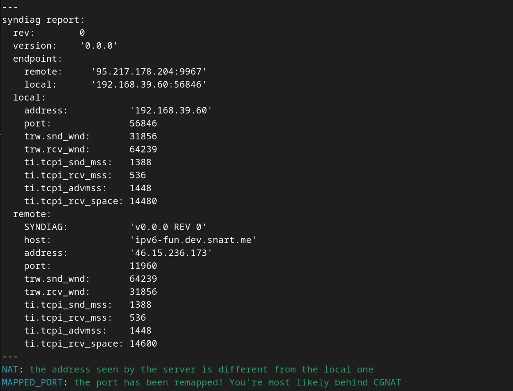
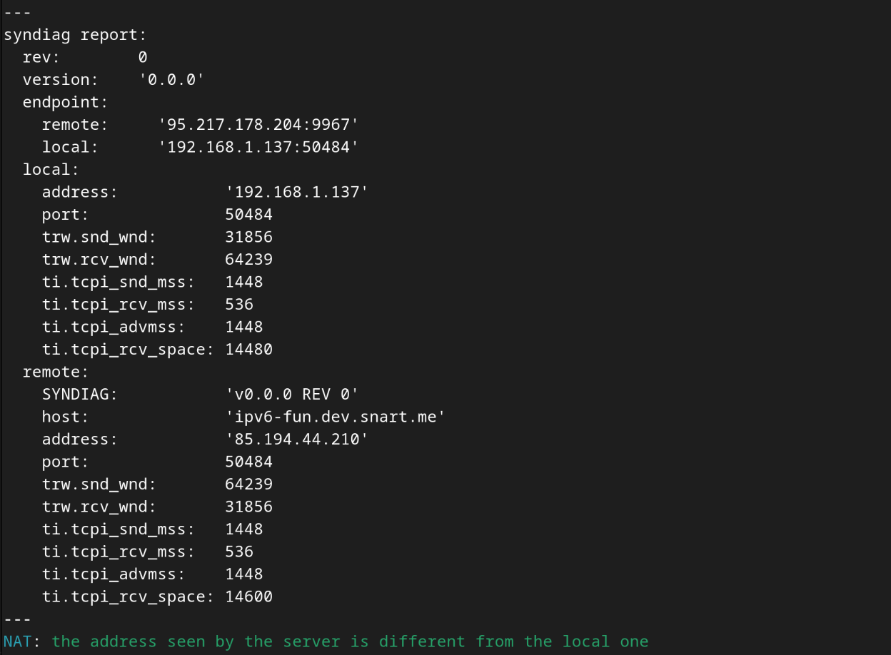

# Syndiag: The Background
By David Timber &lt;dxdt@dev.snart.me&gt;


---

In this document, I will illustrate why I made Syndiag.

The role of the internet service providers(ISPs) in the ecosystem is route the
traffic from customers best they can only using information available at L3
level: the source and destination address, packet length, TTL and hop count. In
reality, it's attempting for ISPs to look further into the upper layers of IP
suite to operate the network in their favor and it's occasionally the case that
they do. Here is the list of the bad things that ISPs typically do to make their
life easier and the yours hard.

- Blocking [ICMP](https://github.com/torvalds/linux/blob/c763c43396883456ef57e5e78b64d3c259c4babc/net/netfilter/Kconfig#L1131)
- Blocking common ports like FTP, SSH, HTTP and HTTPS
- Providing IPv4 CGNAT and no IPv6 in the mobile network
- Doing CGNAT for on-premise products

Here are some things that are in grey area. No one can really tell if these are
good or bad.

- Blocking SMTP (25/TCP)
- Blocking SMB/Netbios (139 and 445)

There are reasons why you can't host your won websites or file sharing system,
use Windows file share over the internet and why Zoom calls suck on mobile. If
you're with the provider that doesn't do any of above, you should be very proud
of your choice. Almost all ISPs do two or three of the things above. All the
things mentioned so far, except for NAT, are passive filtering. The ISP
middleboxes sniff your traffic, drop some packets as needed.

NAT involves active alteration of your traffic. Although it comes with many
disadvantages, we need NAT to combat IPv4 addresses exhaustion. NAT has been one
of the critical components of the internet. It's also an oversight that the
designers of the internet we all pay the price for to this day.

We can say that the ISP really crossed the line when they start manipulating
your traffic for no apparent reason(other than NAT).

I have always been a fan of using IPv6 since the trend of cloud providers
charging for IPv4 addresses became a thing. Some people may think penalising the
use of IPv4 is not fair, but we've all seen this coming for decades and this is
what we get for not pressuring service providers to do the right thing. One of
the project I've been working on can benefit from ability to make P2P
connections on the internet. But having access to IPv6 can be hard depending on
where [you live](https://ispmedipv6.se/isp/) and the sort of providers you're
locked in with. Tunneling is an option, but you'll find that the all address
blocks of affordable VPN, cloud and IX transit services are often blocked
because they're abused by malicious actors. Browsing internet with these
services is no good because the addresses are blocked by most services like
Reddit, Youtube, Google and Facebook. There is not much you can do other than
 wait for your ISP to up their game and start deploying IPv6. But for the
decision makers, the internet simply just works and the idea of deploying IPv6
is not so enticing. Besides, dual-stacking existing existing infrastructure is
hard and comes with [security
implications](https://msrc.microsoft.com/update-guide/en-US/vulnerability/CVE-2024-38063).

There are only a handful of network operators that deployed IPv6 where I live at
the moment. This meant that if I choose the provider carefully, I can have sweet
ISP grade IPv6 with full MTU 1500 to SSH to my instances behind dualstacked
ALBs, whitelist incoming SSH connections with the ISP's /64 prefix, play around
with BGP, test P2P WebRTC and so on. Perhaps I got too excited.

The first thing I did when I got my hands on a Comviq SIM was to test IPv6.
Major websites like ipv6.google.com seem to work, but when I visited
test-ipv6.com, I got this.


Many hours have been spent to troubleshoot. In the end, I managed to deduce the
problem with the ISP. At first, I thought there was something wrong with the
test because the Wireshark capture gave me an impression that ICMP packets are
getting through, but strangely, the ACK for the large test packet is received
before the ICMP packet too big.


As the phantom ACK is received before the ICMP, the transmitted data in the
buffer is long gone, so no retransmission occurs and the connection is broken so
it eventually times out. One interesting fact is that how Linux behaves
differently to other operating systems when it comes to handling the ICMP
received after the ACK.

In function `tcp_v6_err()` in `net/ipv6/tcp_ipv6.c`:

```c
	tp = tcp_sk(sk);
	/* XXX (TFO) - tp->snd_una should be ISN (tcp_create_openreq_child() */
	fastopen = rcu_dereference(tp->fastopen_rsk);
	snd_una = fastopen ? tcp_rsk(fastopen)->snt_isn : tp->snd_una;
	if (sk->sk_state != TCP_LISTEN &&
	    !between(seq, snd_una, tp->snd_nxt)) {
		__NET_INC_STATS(net, LINUX_MIB_OUTOFWINDOWICMPS);
		goto out;
	}
```

Explanation: if the sequence number in the returned TCP header is not in the
range we're expecting, increment the out of window icmp counter and stop
processing.

So, when I run the test using `curl`
[directly](https://test-ipv6.com/faq_pmtud.html), I can see that the
`LINUX_MIB_OUTOFWINDOWICMPS` counter increments(`netstat -ts | grep -i icmp`) as
the ICMP packets keep on coming. Later I found that this is due to the middlebox
trying to retransmit without understanding what's going on - that it has to
intercept the ICMP packet and adjust the PMTU before retransmitting. It appears
that Linux kernel has stringent check on ICMP packets. If the message is related
to an open TCP connection but the returned packet in question is not the one in
transit(ie. not yet ACK'd), the kernel disregards it. Linux calls this kind of
packets "out of window ICMP".

The other operating systems, on the other hand, don't seem to do the "out of
window ICMP" check. The other operating systems honor the out of window ICMP
message and the new PMTU is cached. So after it's cached, it's only a matter of
refreshing the web page(test-ipv6.com) and the test will pass... for the next 10
minutes, which is the duration for which the PMTU is cached. Therefore the users
of the other operating systems will still suffer from random hiccups every 10
minutes.

It's funny how [the code written in 1997](icmp_paranoia.patch) copied and pasted
over the decades is still having an impact on people like me today. (Andi Kleen,
if you're reading this) I was able to identify an issue thanks to the code. I
could have easily disregarded the subtle issue. I'm not saying the check was a
good idea. I have no idea why the check was put in place. I have no background
as to how it got there.

My first intuition is that there was something wrong with the implementation,
[mtu1280d](https://github.com/falling-sky/mtu1280d). Many emails have been
exchanges between me and the maintainer of the website. We went through some
factors that might cause the phantom ACK from the server end including TCP
offloading in the NIC, GRO and GSO at the kernel level. I even implemented my
version of mtu1280d using modern Linux features like [network
namespace](https://github.com/si-magic/mtu1280d/tree/master/netns) and [user
mode linux](https://github.com/si-magic/mtu1280d/tree/master/um). With netns,
UML, the original, I could not reproduce the phantom ACK. I really thought it
was mtu1280d because it did not involve the use any router(virtual or real). My
hypothesis was that the kernel TCP stack was interfering with the implementation
since it uses RAW sockets - this is the observation I made while I was
implementing my [botnet](https://github.com/dxdxdt/proone/).

Turns out, there was nothing wrong with the original mtu1280d, although it has
some flaws that have been addressed in the email communication. Out of the blue,
I decided to compare every packet sent and received by my machine and a VM in
the cloud. First, I set up the mtu1280d and
[mod_ip](https://github.com/falling-sky/mod_ip) on the VM. I turned off all the
offloading features of the NICs on both machines with `ethtool` so that I get
clean unprocessed capture result. Then I fired up Wireshark on my local machine
and on the VM with the GUI X11 forwarded to my machine. Since it's IPv6,
everything has to match bit by bit because there's no NAT. I realised that that
was not the case when I saw the window size values do not match in every single
packet. Something in the network was changing them.

Naturally, I went googling to find out why anyone would do this and what benefit
it brings. This is where I found out about the WAN optimisation industry and the
**TCP acceleration** by the means of **ACK spoofing**. There is not much
information on the internet because it's an ancient technology that is no longer
relevant, at least with modern hardware we have today.

The year was 2000. Memory was a scarce commodity and many servers on the
internet had a small window size. ISPs had to come up with a clever idea to get
good benchmarks over high latency networks. The delay is especially problematic
with GSO satellites because TCP connections get "windowed out" quickly as data
travels at the speed of light to the satellite and back to the ground. All the
64KiB of data suspended in the ether has to come back down to the ground to be
received and acknowledged by the other end. The window scaling TCP option was
[just getting
implemented](https://en.wikipedia.org/wiki/TCP_window_scale_option#Configuration_of_operating_systems).
The solution was to put a middlebox in the ground station to squeeze data out of
applications regardless of the window size set on the hosts. The middlebox can
squeeze the data out as fast as it wants to by ACK'ing ahead of time on behalf
of the other end. In this scheme, the responsibility of TCP retransmission falls
onto the middlebox. The middlebox also has to intercept the legitimate ACKs back
from the other end and drop them. The amount of memory in the middlebox is also
limited so it will have to use its own optimal window size so the packets
wouldn't be dropped because of windowing out. This is the reason why the TCP
accelerator would alter the window size.


- http://web.archive.org/web/20240628070158/https://www.highspeedsat.com/tcp-ip-over-satellite-acceleration.htm
- http://web.archive.org/web/20240908010544/https://www.networkworld.com/article/862336/lan-wan-tcp-acceleration-and-spoofing-acknowledgements.html
- https://networkengineering.stackexchange.com/questions/1440/tcp-acceleration-over-satellite-or-high-latency-networks
<!-- - http://web.archive.org/web/20240415064454/http://www.cs.ucr.edu/~mart/preprints/allerton_paper.pdf -->

In modern days, the network delay is still an issue. Modern applications like
S3, wget, torrent and all file sharing services get around the issue by
transferring data over multiple connections. Doing this effectively gives you
large window spread across multiple small window channels. The other option is
to adjust the parameters such as socket buffer size and ssthresh, but the
applications at the highest level of abstraction don't have access to the low
level API functions like `setsockopt()`. Another issue that it could get around
is L4 fair queueing so the best option the high-level applications are left with
is opening multiple connection and hope for the best(not everyone likes it,
[though](https://fedoraproject.org/wiki/Infrastructure/Mirroring#Limiting_Download_Accelerators)).

The problem with Tele2's middleboxes is that they don't know how to handle PMTU
ICMP packets. Even if they do chop up the large packets to retransmit the data,
there's still the problem with Linux because the Linux kernel won't accept the
forwarded ICMP packet to update the PMTU on their end. At this point, the TCP
acceleration will no longer be the simple "receive, change window, forward to
upstream" scheme. The packets will need to be chopped up every time just for
Linux machines. The engineers of the middleboxes can probably come up with a
clever hack to fool the out of window ICMP check. But manipulating the traffic
in this manner is a bad idea in the first place. The whole TCP acceleration
thing is probably a copied-and-pasted legacy system in their network just like
the out of window check in Linux kernel code, judging by how long they've been
in business.

So I made the tool, Syndiag, to see how many ISPs around the world are doing ACK
spoofing for terrestrial internet. Altered TCP window and PMTU failing are the
two dead giveaway, so Syndiag is focused on detecting those two.

## Remarks
- I'm with 6 different ISPs at the moment and Tele2 remains the only ISP that
  employs TCP acceleration in their network
- I tried to find an open source ACK spoofing implementation to set up the test
  environment but couldn't find one because no competent engineer would think
  this is a good idea to begin with

Now I just made peace with tunneling via a small indie cloud provider that seems
to have clean IP address blocks. For now. Since they're not ISP, their addresses
can be blocked by major services anytime. All it takes is one spammer to ruin it
all.

## Gallery


Typical mobile data network, behind symmetric NAT.



Typical on-premise internet product, behind CPE NAT.


Typical IPv6, regardless of mobile or on-premise.


Taken from Comviq IPv6 mobile data.


Taken from Comviq IPv4 mobile data.
